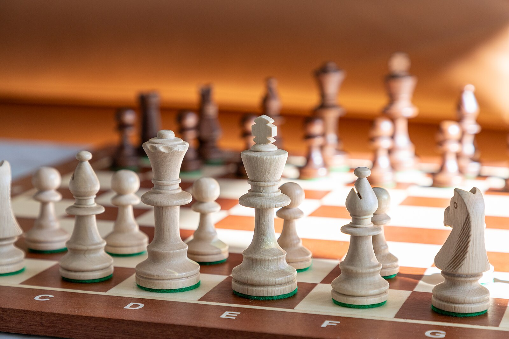

  <h2 align="center">ChessPiece Project Using Java</h2>

 

## Overview
This project demonstrates object-oriented programming concepts in Java through the modeling of a chess board, chess pieces, and their movement rules.  
It includes a back-end logic layer implemented in Java (ChessPiece, ChessRook, ChessBishop, ChessBoard).

---

## Features
### Java Back-End (Core Logic)
- Superclass **ChessPiece** defining common fields (color, row, column)
- Subclasses **ChessRook** and **ChessBishop**, each overriding `validDestination()`
- **ChessBoard**: 2D array `ChessPiece[][]` representing an 8×8 chess board
- Method `theseis()` initializes pieces in standard positions
- `printBoard()` prints board state to terminal
- `getPiece(row, col)` retrieves a piece at a given coordinate
